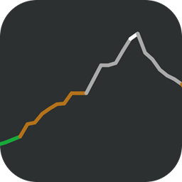

# Swift Procedural Terrain Generator
As of the creation of this repo, Swift Procedural Terrain Generator creates organic terrain with the Y-axis being procedurally generated. Will eventually be expanded to create a 2-dimensional terrain / noise map or 3-dimensional terrain. 

# Noise class usage
- Add `Noise.swift` to your project. 
- `let noise = Noise()`
- Optional: `noise.steepness = 30` 
    - Set how quickly the change is between each point.
- Optional: `noise.spacing = 10.0` 
    - Set the x spacing between each point.
- Optional: `noise.hillFactor = 10`
    - Set how likely the y direction of the noise changes between each point.
- `let noisePoints = noise.generate(samples: 300, maxHeight: self.view.frame.maxY, minHeight: self.view.frame.minY)` 
    - Returns an array of `CGPoint`s
    - `maxHeight` is the maximum `y-coordinate`  in which to generate the points 
    - `minHeight` is the minimum `y-coordingate` in which to generate the points

# Project Usage
- Open `Noise.xcodeproj` in `Xcode`
- Hit `Run`
- You can adjust various aspects of the terrain generator in the settings menu of the application. 